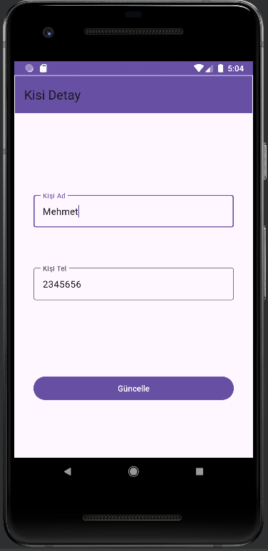
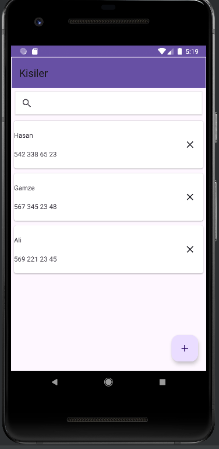
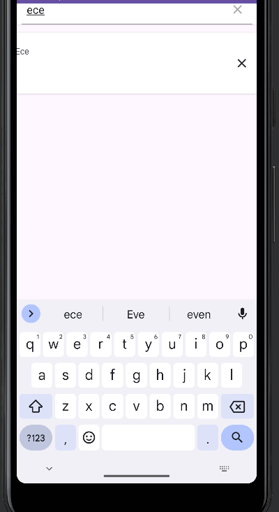

# Simple Contacts App

A straightforward Android application for managing contacts.

## Technologies Used
- Room SQLite: Used for local contact storage.
- MVVM Architecture: Followed the Model-View-ViewModel architectural pattern.
- Repository Pattern: Utilized for data abstraction.
- RecyclerView: Implemented for displaying a list of contacts.

## Features
- **Contact List:** Utilized RecyclerView to display a list of contacts.
- **CRUD Operations:** Allows users to perform Create, Read, Update, and Delete operations on local contacts.
    - **Add/Save:** Ability to add and save new contacts.
    - **Update/Edit:** Supports updating and editing existing contacts.
    - **Delete:** Allows users to delete contacts from the list.

## 
 
 
 
